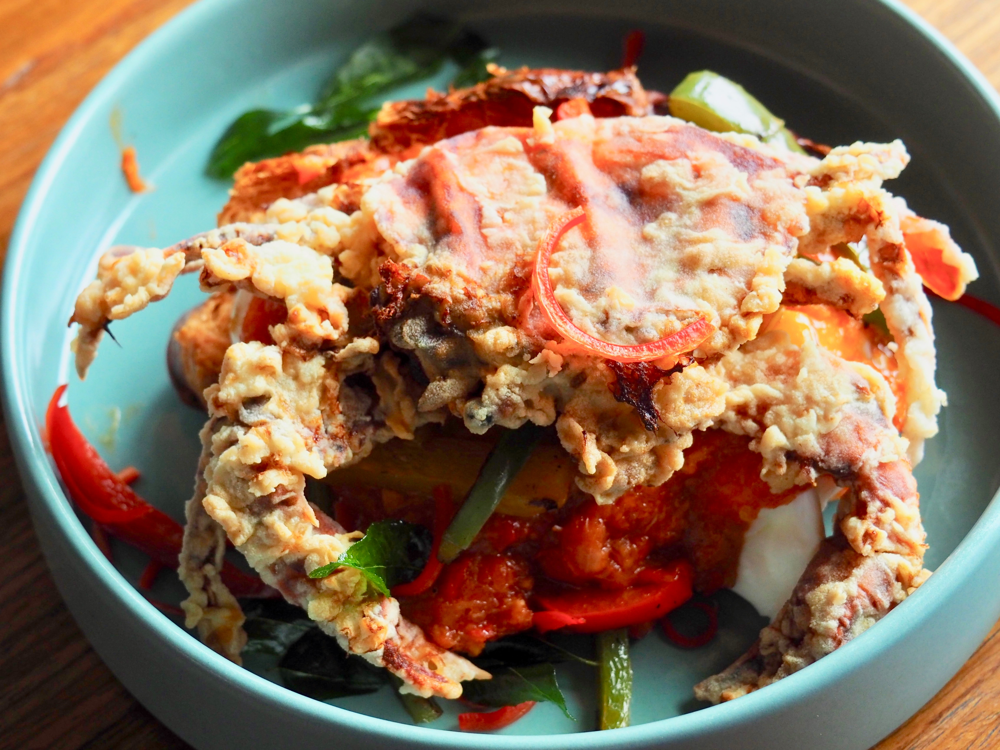

### Ingrediens

1/4 cup olive oil

1 chopped onion

1 bay leaf

2 cloves chopped garlic

2 teaspoon dried oregano

2 teaspoon dried basil

14.5 ounce can crushed tomatoes

1 pinch ground cinnamon

16 ounce package lasagna noodles

1 pint part-skim ricotta cheese

2 beaten eggs

1/2 cup grated Parmesan cheese

2 teaspoon dried basil

1 clove minced garlic

### Directions

1.  Heat 1/4 cup oil in a large skillet over medium heat. Stir in chopped onions and bay leaf; cook and stir until the onion has softened and turned translucent, about 5 minutes. Add 2 cloves minced garlic, oregano, and 2 teaspoons basil; cook and stir for 2 more minutes.

2.  Mix in undrained crushed tomatoes and diced tomatoes. Bring to a boil, reduce heat, and simmer for 1 hour. Stir in cinnamon and set pan aside.

3.  Preheat oven to 350 degrees F (175 degrees C). Lightly grease a 9x13-inch baking dish.

4. Bring a large pot of salted water to boil, add lasagna noodles and bring water to boil again. Cook until noodles are al dente. Drain well.

5. Mix together ricotta, eggs, 1/2 cup Parmesan cheese, 2 teaspoons basil, and 1 clove minced garlic.

6.  Saute sliced onion and mushrooms in 2 tablespoons olive oil until tender, about 5 minutes. Add spinach and zucchini to the skillet. Cover, and cook until spinach is wilted, 2 to 5 minutes. Remove skillet from heat and set aside.

7.  Spread 1/2 cup of the tomato sauce in the prepared baking dish. Place a layer of noodles on top of the tomato sauce; spread all of the ricotta mixture onto the noodles. Place another layer of noodles on top of the ricotta mixture.

8.  Pour about 2 cups tomato sauce onto the noodles; arrange all of the sauteed vegetables on top of the sauce. Top vegetables with noodles and spread the remaining tomato sauce over the final layer of noodles. Top with mozzarella cheese slices and 1 cup grated Parmesan cheese.

9.  Bake the lasagna in the preheated oven until filling is bubbly and cheese is melted and beginning to brown, 45 minutes to 1 hour. Remove the lasagna from the oven and let it cool 10 minutes before serving.