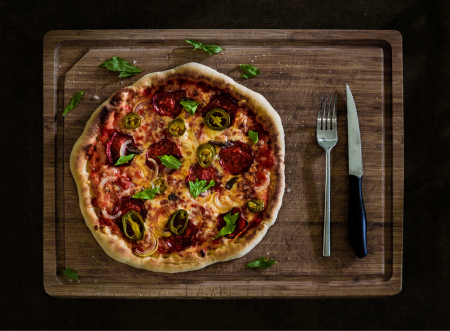

### Ingrediens

8 slices bacon, cut into 1-inch pieces

3/4 cup chopped onion

1/2 teaspoon ground cumin

2 cloves chopped garlic

1/2 teaspoon dried oregano

1/2 teaspoon ground black pepper

1 (8 ounce package) cut into cubes reduced-fat cream cheese

1/4 cup sour cream

1 prepared pizza dough pastry

1 cup shredded mozarella cheese

4 jalapeno pepper, sliced into rings

1 tablespoon dried parsley flakes

### Directions

1.  Preheat oven to 200 degrees C

2.  Place the bacon in a large skillet and cook over medium-high heat, turning occasionally, until evenly browned, about 10 minutes. Remove bacon with a slotted spoon to drain on paper towels, reserving drippings in the pan.

3.  Saute onion in bacon drippings until translucent, 5 to 7 minutes. Add garlic; continue to saute until garlic is golden, 2 to 3 minutes. Season the onion mixture with cumin, oregano, and black pepper. Stir cream cheese and sour cream into the onion mixture until smooth and spreadable.

4. Spread the cream cheese mixture evenly over the pizza dough; top with mozzarella and Cheddar cheeses. Arrange bacon and jalapeno pepper rings over the cheese layer. Sprinkle parsley over the entire pizza.

5. Bake in preheated oven until crust is firm and crispy and the cheese is browned and bubbly, about 30 minutes.