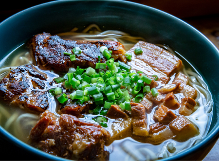

### Ingrediens

1 whole chicken, cut into pieces

1 cup dried scallops

1 cup dried anchovies

1/4 cup dried shrimp

1/4 cup bonito flakes

1 inch piece ginger, thinly slices, divided

4 inch piece dashi kombu (dried kelp)

3 quarts water

1 cup soy sauce

1/2 cup mirin

1/2 cup sake

8 eaches green onions

1/2 cup bonito flakes

1/4 cup white sugar

8 cloves crushed garlic

1/2 cup sake

6 (3 ounce) packages cooked ramen noodles

### Directions

1.  Place chicken, scallops, anchovies, shrimp, bonito flakes, half the ginger, and kombu in an electric pressure cooker. Add water; close and lock the lid. Select the Soup setting; set timer for 90 minutes according to manufacturer's instructions. Allow 10 to 15 minutes for pressure to build.

2.  Release pressure using the natural-release method according to manufacturer's instructions, 10 to 40 minutes. Strain broth through a colander or fine-mesh sieve. Skim the fatty oil off the top of the broth.

3.  Combine soy sauce, mirin, sake, green onions, bonito flakes, sugar, garlic, and kombu in a medium saucepan over high heat. Bring to a boil. Reduce heat to low and simmer until flavors blend, about 10 minutes. Strain tare sauce through a fine-mesh sieve into a bowl.

4. Pour 2 tablespoons of tare sauce into a large bowl. Ladle in about 2 cups of broth. Add 1/6 of the ramen noodles. Repeat with remaining tare, broth, and ramen.