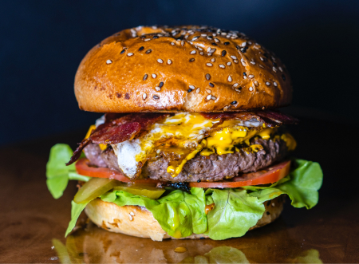

### Ingrediens

2 pounds lean ground turkey

2 tablespoons minced garlic

1 teaspoon minced fresh ginger root

2 fresh green chile peppers, diced

1 medium red onion, diced

1/2 cup fresh cilantro, chopped

1 teaspoon salt

1/4 cup low sodium soy sauce

1 tablespoon freshly ground black pepper

3 tablespoons paprika

1 tablespoon ground dry mustard

1 tablespoon ground cumin

1 dash Worcestershire sauce

### Directions

1.  Preheat the grill for high heat.

2.  In a bowl, mix the ground turkey, garlic, ginger, chile peppers, red onion, cilantro, salt, soy sauce, black pepper, paprika, mustard, cumin, and Worcestershire sauce. Form the mixture into 8 burger patties.

3.  Lightly oil the grill grate. Place turkey burgers on the grill, and cook 5 to 10 minutes per side, until well done.