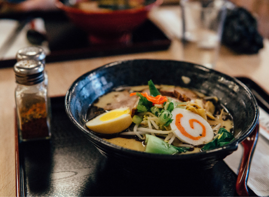

Ramen is a Japanese noodle soup. It consists of Chinese wheat noodles served in a meat or (occasionally) fish-based broth, often flavored with soy sauce or miso, and uses toppings such as sliced pork, nori (dried seaweed), menma, and scallions. Nearly every region in Japan has its own variation of ramen, such as the tonkotsu (pork bone broth) ramen of Kyushu and the miso ramen of Hokkaido. Mazemen is the name of a ramen dish that is not served in a soup, but rather with a sauce (such as tare), like noodles that are served with a sweet and sour sauce.